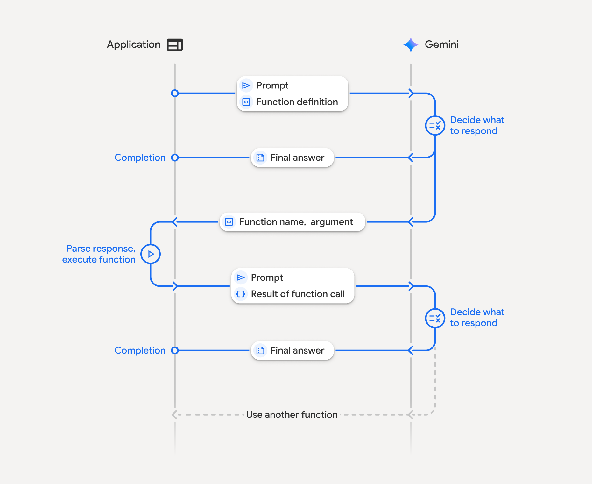

# Axon Pharmacy | Function Calling With LLM

This is an app that allows admin to generate and post announcements to Telegram channels and groups. It also allows users to search for medicines, view medicine details, place orders, view order status, and cancel orders. All done with just a random prompt to Gemini AI.

Here is how it works:


## Setup

1.  **Clone the repository:**
    ```bash
    git clone https://github.com/alexkalll/axon-pharma.git
    cd axon-pharma
    ```
2.  **Install dependencies:**
    ```bash
    pip install -r requirements.txt
    ```
3.  **Environment Variables:**
    Create a `.env` file in the root directory and add the following (replace with your actual values):
    
    ```bash
    GEMINI_API_KEY=your_gemini_api_key
    TELEGRAM_BOT_TOKEN=your_telegram_bot_token
    CHANNEL_USERNAME=@your_telegram_channel_username
    GROUP_USERNAME=@your_telegram_group_username
    # Firebase credentials (if applicable, usually handled by firebase/db_manager.py)
    ```
## Tech Stack
- Python
- Streamlit
- Firebase
- Gemini AI
- Telegram API
- Telegram Bot Integration
- API Integration
- Database Management

## How to Run

### Run the User Application

To run the main user application, use the following command:

```bash
streamlit run app.py
```

### Run the Admin Application

To run the admin dashboard, use the following command:

```bash
streamlit run admin.py # to run the admin page in Streamlit
```

## Features

### Admin Application (`admin.py`)
- **Login:** Admin login with email and password.
- **Generate Announcement:** Create and post pharmacy announcements to Telegram channel and group using Gemini AI.
- **Add Medicine:** Add new medicine entries to the Firebase database.
- **Update Stock:** Modify the stock quantity of existing medicines and notify users if a medicine is out of stock via Telegram.
- **Delete Medicine:** Remove medicine entries from the database and send Telegram notifications.
- **Update Order Status:** Change the status of customer orders in Firebase.

### User Application (`app.py`)
- **Search Medicines Availability:** Search for medicines by name or category.
- **Place Order:** Place a new order for a medicine.
- **Cancel Order:** Cancel a pending or processing order.
- **View Order Status:** Check the status of your order.
- **Get Professional Advice:** Get advice from the llm based on his symptoms and profile details and order status.

